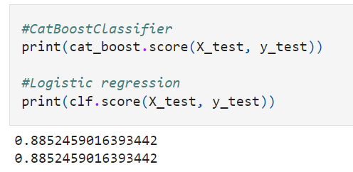

# Heart Disease Predictions
Heart disease is one of the most dangerous disease in the world
but some people usually don't even know that they have a heart disease.

Wouldn't it become nice if we can improve heart disease diagnosis with machine learning so they can diagnose that silent disease earlier before it gets worse only with their clinical parameter right?

In this project we're going to use given clinical parameters about patient and machine learning model, to predict whether or not they have heart disease.

## Data
The original data came from the Cleveland data from UCI Machine Learning Repository. https://archive.ics.uci.edu/ml/datasets/heart+disease

## Result
Best current model: CatBoostClassifier (hyperparameters tuned using GridSearchCV)



## Setup
0.Install Anaconda or Miniconda [here](https://docs.anaconda.com/anaconda/install/)
 
1.Clone the repository, and navigate to the downloaded folder.
```
git clone https://github.com/VincentJonathanz/heart-disease-predictions.git
```
2.Create and activate enviroment.
   - **Anaconda Prompt**:
      ```
      conda env create --prefix ./env -f enviroment.yml
      conda activate heart-disease-predictions/env
      ```
      
   - **Powershell** (you need to run this command first then run the command above):
      ```
      conda init powershell
      Set-ExecutionPolicy -ExecutionPolicy RemoteSigned -Scope CurrentUser
      ```
      
3.Start Jupyter
``` 
jupyter notebook
```


